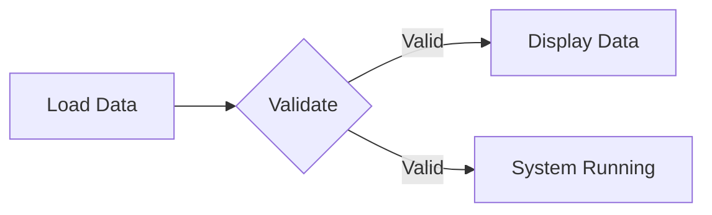
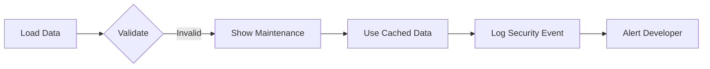

# 🛡️ Firewall Protection & Maintenance Mode
## نظام جدار الحماية ووضع الصيانة

[](https://github.com/aliabdelaal-adm/Monthly_inspection_plan)
[](https://github.com/aliabdelaal-adm/Monthly_inspection_plan)
[](https://github.com/aliabdelaal-adm/Monthly_inspection_plan)

## 📋 Overview - نظرة عامة

A comprehensive security system to protect the Monthly Inspection Plan application from data corruption and unauthorized modifications. The system automatically validates all data and displays a beautiful maintenance mode overlay when issues are detected.

نظام حماية شامل لحماية تطبيق خطة التفتيش الشهرية من تلف البيانات والتعديلات غير المصرح بها. يقوم النظام تلقائياً بالتحقق من جميع البيانات ويعرض واجهة صيانة جميلة عند اكتشاف مشاكل.

---

## 🎯 Key Features - المميزات الرئيسية

### 1. 🛡️ Multi-Layer Security - الأمان متعدد الطبقات

| Layer | Description | Arabic |
|-------|-------------|--------|
| **Layer 1** | Initial page load validation | التحقق عند تحميل الصفحة |
| **Layer 2** | Auto-refresh validation (every 30s) | التحقق التلقائي كل 30 ثانية |
| **Layer 3** | Safe data fallback from cache | استخدام البيانات الآمنة المخزنة |
| **Layer 4** | Comprehensive security logging | سجل أمان شامل |

### 2. ✅ Data Validation Rules - قواعد التحقق

- ✔️ Inspector names must start with "د." (Dr.)
- ✔️ Length: 5-50 characters
- ✔️ No numbers or special symbols
- ✔️ Arabic letters and spaces only
- ✔️ Whitelist verification
- ✔️ No duplicate IDs

### 3. 🎨 Beautiful Maintenance UI - واجهة صيانة جميلة


**Design Elements:**
- 🛡️ Animated shield icon
- 🔒 Bouncing lock icon
- 🌈 Gradient background
- ⚙️ Triple spinning rings
- ✨ Shimmer light effect
- 🎨 Color-shifting title

---

## 🚀 Quick Start - البدء السريع

### Automatic Protection - الحماية التلقائية

The system works automatically! No configuration needed. It will:

1. ✅ Validate data on page load
2. ✅ Check data every 30 seconds
3. ✅ Show maintenance mode if issues found
4. ✅ Use cached safe data as fallback

النظام يعمل تلقائياً! لا حاجة للإعداد. سوف:

1. ✅ يتحقق من البيانات عند تحميل الصفحة
2. ✅ يفحص البيانات كل 30 ثانية
3. ✅ يعرض وضع الصيانة عند اكتشاف مشاكل
4. ✅ يستخدم البيانات الآمنة المخزنة

---

## 📊 Test Results - نتائج الاختبار

### ✅ Current Data Test - اختبار البيانات الحالية

```
Testing: 18 inspectors
✅ Valid: 18 (100%)
❌ Invalid: 0
⚠️  Unknown: 0

Result: PASSED ✓
Maintenance mode: NOT triggered
```

### 🚨 Malicious Data Test - اختبار البيانات الضارة

```
Testing: 6 entries (5 malicious, 1 valid)

❌ BLOCKED: "هكر مزيف" (no د. prefix)
❌ BLOCKED: "د. Test123" (contains numbers)
❌ BLOCKED: "admin@hacker.com" (invalid format)
❌ BLOCKED: XSS attempt with <script> tags
❌ BLOCKED: "د. ش" (too short)
✅ ALLOWED: "د. علي عبدالعال"

Result: 5 malicious entries blocked
Protection: ACTIVE 🛡️
Maintenance mode: WOULD TRIGGER ⚠️
```

---

## 🎬 How It Works - كيف يعمل

### Scenario 1: Normal Operation ✅



### Scenario 2: Hacker Attack Detected 🚨



---

## 📸 Screenshots - لقطات الشاشة

### Maintenance Mode with Error Details


### Simple Maintenance Mode  


---

## 💻 Code Functions - الوظائف البرمجية

### Core Functions

| Function | Purpose |
|----------|---------|
| `validateInspectorNames()` | Validates inspector name format |
| `validateDataIntegrity()` | Checks complete data structure |
| `showMaintenanceMode()` | Displays maintenance overlay |
| `hideMaintenanceMode()` | Hides maintenance overlay |
| `firewallCheck()` | Runs comprehensive security check |
| `performDataValidation()` | Executes full validation process |

### Usage Example

```javascript
// Manual validation check
const data = loadDataFromJSON();
const isValid = performDataValidation(data);

if (!isValid) {
    showMaintenanceMode(['Custom error message']);
}

// Manual mode control
showMaintenanceMode(['تحديث النظام', 'جاري الإصلاح']);
setTimeout(() => hideMaintenanceMode(), 5000);
```

---

## 🔐 Security Logs - سجلات الأمان

All security events are logged to the browser console:

```
🛡️ Firewall: Validating incoming data...
✅ Firewall: Data validation passed
❌ Firewall: Data validation failed!
⚠️  Maintenance Mode Activated
Issues found: ['مفتش غير صحيح...']
```

---

## 🧪 Testing - الاختبار

### Test File
Open `test_maintenance_mode.html` in your browser to:
- View maintenance mode with errors
- View simple maintenance mode  
- Test UI animations
- See example messages

### Manual Testing
```bash
# Start local server
python3 -m http.server 8080

# Open browser
http://localhost:8080/test_maintenance_mode.html
```

---

## 📝 Customization - التخصيص

### Add New Inspector to Whitelist

Edit `index.html` function `validateInspectorNames()`:

```javascript
const validInspectorPatterns = [
    /^د\.\s*.+$/,
    /علي\s*عبدالعال/,
    // Add new pattern here
    /new\s*inspector\s*name/
];
```

### Customize Maintenance Message

```javascript
showMaintenanceMode([
    'رسالة مخصصة 1',
    'رسالة مخصصة 2',
    'رسالة مخصصة 3'
]);
```

---

## 🎯 Message Display - عرض الرسائل

### Main Message (Always Shown)
```
الزملاء الأعزاء
جاري تحديث البيانات
شكراً على الانتظار
```

### Details (When Issues Found)
```
تفاصيل التحديث:
• تم اكتشاف أسماء مفتشين غير صحيحة
• مفتش غير صحيح: "..." - السبب
• جاري إصلاح المشاكل وتأمين البيانات...
```

---

## ✅ Authorized Inspectors - المفتشون المعتمدون

| # | Name | Status |
|---|------|--------|
| 1 | د. علي عبدالعال | ✅ Authorized |
| 2 | د. آمنه بن صرم | ✅ Authorized |
| 3 | د. آيه سلامة | ✅ Authorized |
| 4 | د. حسينة العامري | ✅ Authorized |
| 5 | د. حصة العلي | ✅ Authorized |
| 6 | د. فايز المسالمة | ✅ Authorized |
| 7 | د. محمد إسماعيل | ✅ Authorized |
| 8 | د. محمد سعيد | ✅ Authorized |
| 9 | د. هاجر الغافري | ✅ Authorized |
| 10 | د. سعاد السامرائي | ✅ Authorized |
| 11 | د. طارق حمزة | ✅ Authorized |
| 12 | د. وائل عبدالرحيم | ✅ Authorized |

---

## 📚 Additional Documentation

- Full details: [SECURITY_MAINTENANCE_MODE_AR.md](SECURITY_MAINTENANCE_MODE_AR.md)
- Testing guide: `test_maintenance_mode.html`
- Implementation: `index.html` (lines 4341-4512)

---

## 🤝 Contributing

To report security issues or suggest improvements:
1. Open an issue on GitHub
2. Contact: د. علي عبدالعال
3. Email: [Contact via GitHub]

---

## 📜 License

Part of the Monthly Inspection Plan project
© 2025 د. علي عبدالعال

---

## 🎉 Summary

**✅ Complete Security System Implemented**
- Multi-layer firewall protection
- Beautiful maintenance mode UI
- Automatic validation
- Safe data fallback
- Comprehensive logging
- Tested & verified

**النظام جاهز للاستخدام! 🚀**

---

**Version:** 1.0  
**Status:** ✅ Production Ready  
**Last Updated:** October 2025  
**Developer:** د. علي عبدالعال via GitHub Copilot
