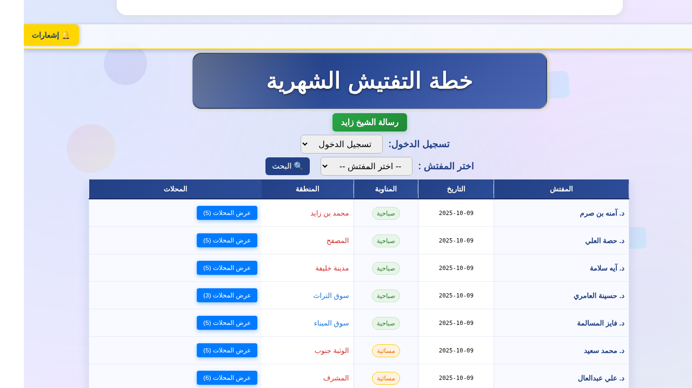
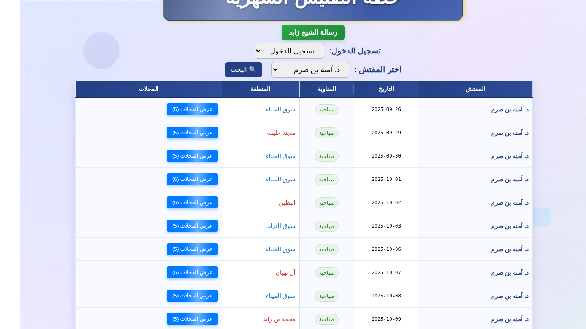
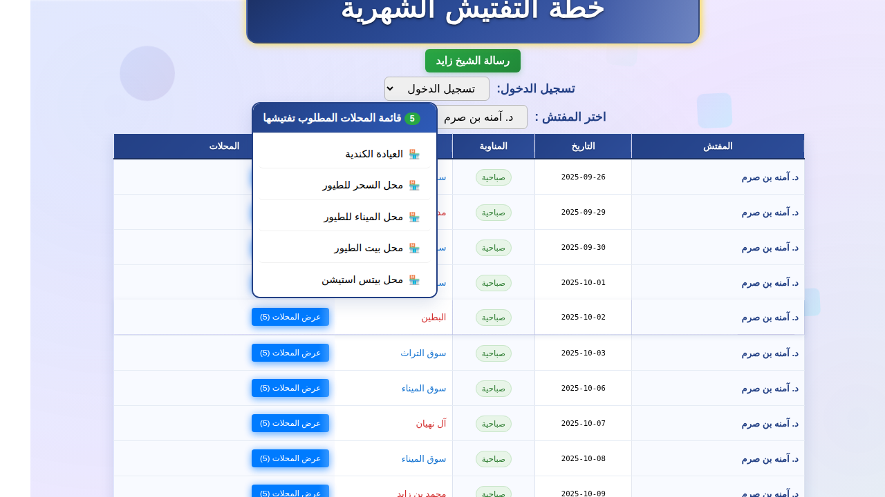

# إصلاح عرض التفتيشات المجدولة - PR #326
# Fix: Display All Scheduled Inspections - PR #326

## 📋 المشكلة / Problem

### بالعربية
لم تظهر التفتيشات المجدولة في الأيام الماضية عند اختيار مفتش معين. كان النظام يعرض فقط التفتيشات من اليوم الحالي فصاعداً، مما يمنع المستخدمين من رؤية السجل الكامل للتفتيشات المجدولة.

### English
Scheduled inspections for past days were not displayed when selecting a specific inspector. The system only showed inspections from the current day onwards, preventing users from viewing the complete inspection schedule history.

---

## 🔍 السبب الجذري / Root Cause

### الكود القديم / Old Code
```javascript
if (!hasActiveSearchFilters) {
    const today = new Date().toLocaleDateString('en-CA');
    
    if (selectedInspector) {
        // عرض التفتيشات من اليوم الحالي فصاعداً فقط
        rows = rows.filter(item => item.day >= today);
    } else {
        rows = rows.filter(item => item.day === today);
    }
}
```

**المشكلة:** عند اختيار مفتش، كان الفلتر `item.day >= today` يستبعد جميع التفتيشات الماضية.

**Problem:** When selecting an inspector, the filter `item.day >= today` excluded all past inspections.

---

## ✅ الحل / Solution

### الكود الجديد / New Code
```javascript
if (!hasActiveSearchFilters && !selectedInspector) {
    // بدون اختيار مفتش: عرض تفتيشات اليوم الحالي فقط
    const today = new Date().toLocaleDateString('en-CA');
    rows = rows.filter(item => item.day === today);
}
// عند اختيار مفتش: عرض جميع التفتيشات (الماضية والحالية والمستقبلية)
```

### التغييرات الرئيسية / Key Changes

1. **إزالة فلتر التاريخ عند اختيار مفتش**
   - Remove date filter when inspector is selected
   - Shows ALL inspections for the selected inspector

2. **الحفاظ على السلوك الافتراضي**
   - Maintain default behavior (today's inspections only when no inspector selected)
   
3. **تحديث الرسائل**
   - Updated message from "upcoming inspections" (القادمة) to "all inspections" (جميع)

---

## 📊 نتائج الاختبار / Test Results

### 1. العرض الافتراضي (بدون اختيار مفتش) / Default View (No Inspector Selected)

**النتيجة:** 8 تفتيشات ليوم 2025-10-09 فقط ✅

**Result:** 8 inspections for 2025-10-09 only ✅



---

### 2. بعد اختيار مفتش (د. آمنه بن صرم) / After Selecting Inspector

**النتيجة:** 11 تفتيش من 2025-09-26 إلى 2025-10-10 ✅

**Result:** 11 inspections from 2025-09-26 to 2025-10-10 ✅

| التاريخ / Date | المنطقة / Area | المحلات / Shops |
|----------------|----------------|-----------------|
| 2025-09-26 | سوق الميناء | 5 |
| 2025-09-29 | مدينة خليفة | 5 |
| 2025-09-30 | سوق الميناء | 5 |
| 2025-10-01 | سوق الميناء | 6 |
| 2025-10-02 | البطين | 5 |
| 2025-10-03 | سوق التراث | 5 |
| 2025-10-06 | سوق الميناء | 5 |
| 2025-10-07 | آل نهيان | 5 |
| 2025-10-08 | سوق الميناء | 5 |
| 2025-10-09 | محمد بن زايد | 5 |
| 2025-10-10 | الخالدية | 5 |



---

### 3. قائمة المحلات / Shops Dropdown

**النتيجة:** تعمل بشكل صحيح ✅

**Result:** Working correctly ✅


---

### 4. العودة للعرض الافتراضي / Return to Default View

**النتيجة:** يعود لعرض تفتيشات اليوم فقط ✅

**Result:** Returns to showing today's inspections only ✅



---

## 💻 التغييرات البرمجية / Code Changes

### الملف المعدل / Modified File: `index.html`

**السطور المعدلة / Modified Lines:** 7167-7182, 7195, 7209

```diff
- // تطبيق فلتر اليوم الحالي كافتراضي (إلا إذا كان المستخدم يستخدم البحث)
- const hasActiveSearchFilters = Object.keys(currentSearchFilters).length > 0 && 
-     (currentSearchFilters.fromDate || currentSearchFilters.toDate || 
-      currentSearchFilters.area || currentSearchFilters.shift);
- 
- if (!hasActiveSearchFilters) {
-     const today = new Date().toLocaleDateString('en-CA'); // YYYY-MM-DD format in local timezone
-     
-     if (selectedInspector) {
-         // عند اختيار مفتش: عرض جميع التفتيشات من اليوم الحالي فصاعداً
-         rows = rows.filter(item => item.day >= today);
-     } else {
-         // بدون اختيار مفتش: عرض تفتيشات اليوم الحالي فقط
-         rows = rows.filter(item => item.day === today);
-     }
- }

+ // تطبيق فلتر اليوم الحالي كافتراضي (إلا إذا كان المستخدم يستخدم البحث)
+ const hasActiveSearchFilters = Object.keys(currentSearchFilters).length > 0 && 
+     (currentSearchFilters.fromDate || currentSearchFilters.toDate || 
+      currentSearchFilters.area || currentSearchFilters.shift);
+ 
+ if (!hasActiveSearchFilters && !selectedInspector) {
+     // بدون اختيار مفتش: عرض تفتيشات اليوم الحالي فقط
+     const today = new Date().toLocaleDateString('en-CA'); // YYYY-MM-DD format in local timezone
+     rows = rows.filter(item => item.day === today);
+ }
+ // عند اختيار مفتش: عرض جميع التفتيشات (الماضية والحالية والمستقبلية)
```

```diff
- // عند اختيار مفتش: عرض جميع التفتيشات القادمة
- searchResultsInfo.innerHTML = `<strong>تفتيشات ${selectedInspector} القادمة:</strong> <span id="searchResultsCount">${rows.length}</span> تفتيش`;

+ // عند اختيار مفتش: عرض جميع التفتيشات
+ searchResultsInfo.innerHTML = `<strong>جميع تفتيشات ${selectedInspector}:</strong> <span id="searchResultsCount">${rows.length}</span> تفتيش`;
```

```diff
- container.innerHTML = `<div style="text-align:center;color:#666;font-weight:bold;margin:30px 0;">لا توجد تفتيشات قادمة للمفتش ${selectedInspector}</div>`;

+ container.innerHTML = `<div style="text-align:center;color:#666;font-weight:bold;margin:30px 0;">لا توجد تفتيشات للمفتش ${selectedInspector}</div>`;
```

---

## 🎯 السلوك المتوقع / Expected Behavior

### قبل الإصلاح / Before Fix

| الحالة / Scenario | التفتيشات المعروضة / Inspections Shown |
|-------------------|----------------------------------------|
| بدون اختيار مفتش | تفتيشات اليوم فقط ✅ |
| مع اختيار مفتش | من اليوم فصاعداً فقط ❌ |

### بعد الإصلاح / After Fix

| الحالة / Scenario | التفتيشات المعروضة / Inspections Shown |
|-------------------|----------------------------------------|
| بدون اختيار مفتش | تفتيشات اليوم فقط ✅ |
| مع اختيار مفتش | **جميع التفتيشات** (ماضية + حالية + مستقبلية) ✅ |

---

## ✨ الفوائد / Benefits

### للمستخدمين / For Users
- 📅 عرض السجل الكامل للتفتيشات المجدولة
- 🔍 سهولة مراجعة التفتيشات السابقة
- 📊 رؤية شاملة لجدول المفتش الشهري

### For Users
- 📅 View complete inspection schedule history
- 🔍 Easy review of past inspections
- 📊 Comprehensive view of monthly inspector schedule

---

## 🔧 التوصيات المستقبلية / Future Recommendations

### للمطورين / For Developers
- [ ] إضافة خيار لتصفية التفتيشات حسب نطاق زمني محدد
- [ ] إضافة إحصائيات للتفتيشات المنجزة والقادمة
- [ ] تحسين الأداء عند عرض عدد كبير من التفتيشات

### For Developers
- [ ] Add option to filter inspections by specific date range
- [ ] Add statistics for completed and upcoming inspections
- [ ] Improve performance when displaying large number of inspections

---

## ✅ الخلاصة / Conclusion

تم إصلاح المشكلة بنجاح عن طريق تعديل منطق الفلترة لعرض جميع التفتيشات المجدولة (الماضية والحالية والمستقبلية) عند اختيار مفتش معين، مع الحفاظ على السلوك الافتراضي لعرض تفتيشات اليوم فقط عند عدم اختيار أي مفتش.

The issue was successfully fixed by modifying the filtering logic to display all scheduled inspections (past, present, and future) when selecting a specific inspector, while maintaining the default behavior of showing only today's inspections when no inspector is selected.

---

**الحالة / Status:** ✅ محلول / RESOLVED  
**الأولوية / Priority:** 🔴 عالية / HIGH  
**التأثير / Impact:** 👥 جميع المفتشين / ALL INSPECTORS  
**التاريخ / Date:** 2025-10-09  
**رقم الـ PR / PR Number:** #326

---

**المطور / Developer:** Ali Abdelaal (via GitHub Copilot)  
**المراجعة / Review:** Pending
