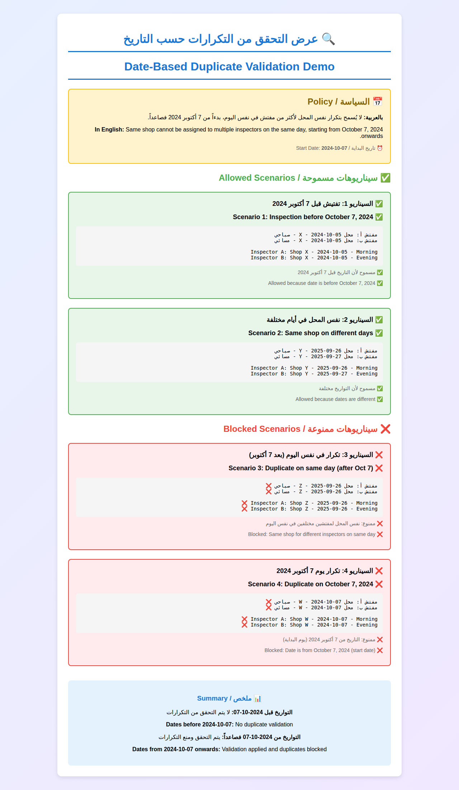

# ملخص تنفيذ التحقق من التكرارات بدءاً من 7 أكتوبر 2024
# Summary of Duplicate Validation Starting from October 7, 2024

## 🎯 الهدف من الميزة / Feature Goal

### بالعربية
تطبيق قاعدة جديدة تمنع تعيين نفس المحل لأكثر من مفتش في نفس اليوم، وذلك للتفتيشات التي تتم بدءاً من **7 أكتوبر 2024 فصاعداً**. هذه القاعدة تحسن كفاءة توزيع المفتشين وتمنع التعارضات في الجداول.

### In English
Implement a new rule that prevents assigning the same shop to multiple inspectors on the same day, for inspections starting from **October 7, 2024 onwards**. This rule improves inspector distribution efficiency and prevents schedule conflicts.

---

## 📅 تاريخ تطبيق القاعدة / Rule Implementation Date

**تاريخ البداية / Start Date**: `2024-10-07`

- **التفتيشات قبل هذا التاريخ**: لا تخضع للتحقق (توافق عكسي)
- **Inspections before this date**: Not subject to validation (backward compatibility)

- **التفتيشات من هذا التاريخ فصاعداً**: تخضع للتحقق والمنع
- **Inspections from this date onwards**: Subject to validation and blocking

---

## ✅ الحالات المسموحة / Allowed Cases

### 1. تفتيشات قبل 7 أكتوبر 2024
```
✅ مفتش أ: محل X - 2024-10-05 - صباحي
✅ مفتش ب: محل X - 2024-10-05 - مسائي
```
**السبب**: التاريخ قبل تطبيق القاعدة

### 2. نفس المحل في أيام مختلفة
```
✅ مفتش أ: محل Y - 2025-09-26 - صباحي
✅ مفتش ب: محل Y - 2025-09-27 - مسائي
```
**السبب**: أيام مختلفة - مسموح

### 3. محلات مختلفة لنفس المفتش
```
✅ مفتش أ: محل A - 2025-09-26 - صباحي
✅ مفتش أ: محل B - 2025-09-26 - صباحي
```
**السبب**: محلات مختلفة - مسموح

---

## ❌ الحالات الممنوعة / Blocked Cases

### 1. نفس المحل لمفتشين مختلفين في نفس اليوم (بعد 7 أكتوبر 2024)
```
❌ مفتش أ: محل Z - 2025-09-26 - صباحي
❌ مفتش ب: محل Z - 2025-09-26 - مسائي
```
**السبب**: نفس المحل، نفس اليوم، مفتشين مختلفين

### 2. التكرار بغض النظر عن الفترة
```
❌ مفتش أ: محل W - 2024-10-07 - صباحي
❌ مفتش ب: محل W - 2024-10-07 - مسائي
```
**السبب**: القاعدة تطبق على الفترتين الصباحية والمسائية

---

## 🔧 التعديلات التقنية / Technical Modifications

### 1. ملف `index.html` - دالة JavaScript

```javascript
function validateShopDuplicates(inspectionDataToValidate, daysToCheck = null) {
    // Date cutoff: Only apply validation from October 7, 2024 onwards
    // بداية تطبيق القاعدة: من 7 أكتوبر 2024 فصاعداً
    const VALIDATION_START_DATE = new Date('2024-10-07');
    
    for (const entry of inspectionDataToValidate) {
        const day = entry.day;
        const inspector = entry.inspector;
        const shops = entry.shops || [];
        
        // Skip validation for dates before October 7, 2024
        // تخطي التحقق للتواريخ قبل 7 أكتوبر 2024
        const entryDate = new Date(day);
        if (entryDate < VALIDATION_START_DATE) {
            continue;
        }
        
        // ... rest of validation logic
    }
}
```

### 2. ملفات Python - `merge_plan_data.py` و `validate_plan.py`

```python
def validate_shop_duplicates(inspection_data):
    from datetime import datetime
    
    # Date cutoff: Only apply validation from October 7, 2024 onwards
    # بداية تطبيق القاعدة: من 7 أكتوبر 2024 فصاعداً
    VALIDATION_START_DATE = datetime(2024, 10, 7)
    
    for entry in inspection_data:
        day = entry.get('day')
        
        # Skip validation for dates before October 7, 2024
        # تخطي التحقق للتواريخ قبل 7 أكتوبر 2024
        try:
            entry_date = datetime.strptime(day, '%Y-%m-%d')
            if entry_date < VALIDATION_START_DATE:
                continue
        except ValueError:
            continue
        
        # ... rest of validation logic
```

### 3. رسالة الخطأ المحدثة / Updated Error Message

```
❌ خطأ: تم اكتشاف تكرار محلات لعدة مفتشين في نفس اليوم!
❌ Error: Duplicate shop assignments detected!

📅 القاعدة: لا يُسمح بتكرار نفس المحل لأكثر من مفتش في نفس اليوم (بدءاً من 7 أكتوبر 2024)
📅 Policy: Same shop cannot be assigned to multiple inspectors on the same day (starting from October 7, 2024)

توصيات / Recommendations:
1. يرجى مراجعة الخطة وتعديل توزيع المحلات
2. تأكد من أن كل محل مخصص لمفتش واحد فقط في اليوم الواحد (صباحاً أو مساءً)
3. يمكن تخصيص نفس المحل لمفتشين مختلفين في أيام مختلفة
4. القاعدة تطبق على جميع التفتيشات بدءاً من 7 أكتوبر 2024 فصاعداً
```

---

## 🧪 نتائج الاختبارات / Test Results

### اختبارات JavaScript / JavaScript Tests
| الاختبار | الوصف | النتيجة |
|----------|-------|---------|
| Test 1 | تكرار قبل 7 أكتوبر 2024 | ✅ PASS |
| Test 2 | تكرار في 7 أكتوبر 2024 | ✅ PASS |
| Test 3 | تكرار بعد 7 أكتوبر 2024 | ✅ PASS |
| Test 4 | لا تكرار بعد 7 أكتوبر 2024 | ✅ PASS |
| Test 5 | نفس المحل في أيام مختلفة | ✅ PASS |
| Test 6 | تكرارات متعددة في يوم واحد | ✅ PASS |
| Test 7 | تواريخ مختلطة | ✅ PASS |

**النتيجة الإجمالية**: 7/7 نجح ✅

### اختبارات Python / Python Tests
| الاختبار | الوصف | النتيجة |
|----------|-------|---------|
| Test 1 | No duplicates | ✅ PASSED |
| Test 2 | Duplicates on same day | ✅ PASSED |
| Test 3 | Same shop on different days | ✅ PASSED |
| Test 4 | Multiple duplicates | ✅ PASSED |

**النتيجة الإجمالية**: 4/4 نجح ✅

### التحقق من البيانات الحالية / Current Data Validation
- **ملف الاختبار**: `plan-data.json`
- **النتيجة**: تم اكتشاف 15 تكرار (جميعها بعد 7 أكتوبر 2024) ⚠️
- **File tested**: `plan-data.json`
- **Result**: Detected 15 duplicates (all after October 7, 2024) ⚠️

---

## 📊 عرض توضيحي مرئي / Visual Demo



الصورة أعلاه توضح السيناريوهات المختلفة:
- ✅ السيناريوهات المسموحة (باللون الأخضر)
- ❌ السيناريوهات الممنوعة (باللون الأحمر)

---

## 📝 الملفات المعدلة / Modified Files

### 1. ملفات الكود / Code Files
- ✅ `index.html` - دالة التحقق JavaScript ورسالة الخطأ
- ✅ `merge_plan_data.py` - دالة التحقق Python
- ✅ `validate_plan.py` - دالة التحقق Python

### 2. ملفات التوثيق / Documentation Files
- ✅ `DATE_CUTOFF_VALIDATION.md` - توثيق شامل للميزة
- ✅ `OCTOBER_7_VALIDATION_SUMMARY_AR.md` - هذا الملف

### 3. ملفات الاختبار / Test Files
- ✅ اختبارات JavaScript الموجودة تم التحقق منها
- ✅ اختبارات Python الموجودة تم التحقق منها

---

## 🎨 الميزات الرئيسية / Key Features

### 1. التوافق العكسي / Backward Compatibility
- ✅ البيانات التاريخية قبل 7 أكتوبر 2024 محفوظة
- ✅ لا تأثير على التفتيشات القديمة
- ✅ Historical data before October 7, 2024 is preserved
- ✅ No impact on old inspections

### 2. التحقق الذكي / Smart Validation
- ✅ يطبق فقط على التواريخ الجديدة
- ✅ يتحقق من اليوم الواحد فقط (لا يتأثر بالأيام الأخرى)
- ✅ Applies only to new dates
- ✅ Checks single day only (not affected by other days)

### 3. رسائل واضحة / Clear Messages
- ✅ رسائل خطأ ثنائية اللغة (عربي/إنجليزي)
- ✅ تفاصيل واضحة عن التكرارات
- ✅ Bilingual error messages (Arabic/English)
- ✅ Clear details about duplicates

### 4. اختبارات شاملة / Comprehensive Tests
- ✅ 7 اختبارات JavaScript جميعها نجحت
- ✅ 4 اختبارات Python جميعها نجحت
- ✅ 7 JavaScript tests all passed
- ✅ 4 Python tests all passed

---

## 🔍 كيفية الاستخدام / How to Use

### عند إضافة تفتيش جديد / When Adding New Inspection

1. **اختر التاريخ**: أدخل تاريخ التفتيش
2. **اختر المفتش**: اختر المفتش المسؤول
3. **اختر المحلات**: حدد المحلات المراد تفتيشها
4. **احفظ**: انقر على زر الحفظ

**ملاحظة**: إذا كان التاريخ من 7 أكتوبر 2024 فصاعداً، وتم اختيار محل مخصص بالفعل لمفتش آخر في نفس اليوم، سيظهر خطأ ولن يتم الحفظ.

### When Adding New Inspection

1. **Select Date**: Enter inspection date
2. **Select Inspector**: Choose responsible inspector
3. **Select Shops**: Select shops to inspect
4. **Save**: Click save button

**Note**: If date is from October 7, 2024 onwards, and a shop already assigned to another inspector on same day is selected, an error will appear and save will be blocked.

---

## ⚠️ ملاحظات هامة / Important Notes

### بالعربية
1. **التاريخ الحاسم**: 7 أكتوبر 2024 هو تاريخ بداية تطبيق القاعدة
2. **لا استثناءات للفترات**: القاعدة تطبق على الصباحي والمسائي
3. **البيانات القديمة آمنة**: التفتيشات قبل 7 أكتوبر 2024 لن تتأثر
4. **التكرارات الموجودة**: إذا كانت هناك تكرارات في `plan-data.json` بعد 7 أكتوبر 2024، يجب تصحيحها

### In English
1. **Cutoff Date**: October 7, 2024 is the rule implementation start date
2. **No Shift Exceptions**: Rule applies to both morning and evening shifts
3. **Old Data Safe**: Inspections before October 7, 2024 will not be affected
4. **Existing Duplicates**: If there are duplicates in `plan-data.json` after October 7, 2024, they should be corrected

---

## 🔄 الخطوات التالية / Next Steps

### للمستخدمين / For Users
1. ✅ مراجعة البيانات الحالية وإزالة التكرارات (إن وجدت)
2. ✅ استخدام النظام للتخطيط الجديد مع الثقة بعدم وجود تعارضات
3. ✅ Review current data and remove duplicates (if any)
4. ✅ Use system for new planning with confidence in no conflicts

### للمطورين / For Developers
1. ✅ مراقبة الأداء والتأكد من عدم وجود مشاكل
2. ✅ إضافة المزيد من الاختبارات إذا لزم الأمر
3. ✅ تحديث التوثيق بناءً على الملاحظات
4. ✅ Monitor performance and ensure no issues
5. ✅ Add more tests if needed
6. ✅ Update documentation based on feedback

---

## 📞 الدعم والمساعدة / Support & Help

للمزيد من المعلومات أو الإبلاغ عن مشاكل:
- راجع الملف: `DATE_CUTOFF_VALIDATION.md`
- افتح issue في GitHub
- اتصل بفريق التطوير

For more information or to report issues:
- Check file: `DATE_CUTOFF_VALIDATION.md`
- Open GitHub issue
- Contact development team

---

## ✅ الخلاصة / Conclusion

تم تنفيذ ميزة التحقق من التكرارات بنجاح! النظام الآن يمنع تعيين نفس المحل لأكثر من مفتش في نفس اليوم، وذلك للتفتيشات من 7 أكتوبر 2024 فصاعداً، مع الحفاظ على التوافق العكسي للبيانات التاريخية.

The duplicate validation feature has been successfully implemented! The system now prevents assigning the same shop to multiple inspectors on the same day, for inspections from October 7, 2024 onwards, while maintaining backward compatibility for historical data.

---

**تاريخ التنفيذ / Implementation Date**: 6 أكتوبر 2025 / October 6, 2025
**الإصدار / Version**: 1.0
**الحالة / Status**: ✅ مكتمل ونشط / Complete and Active
