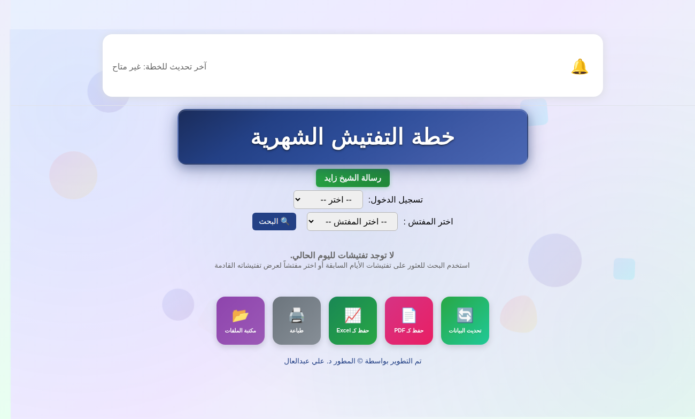
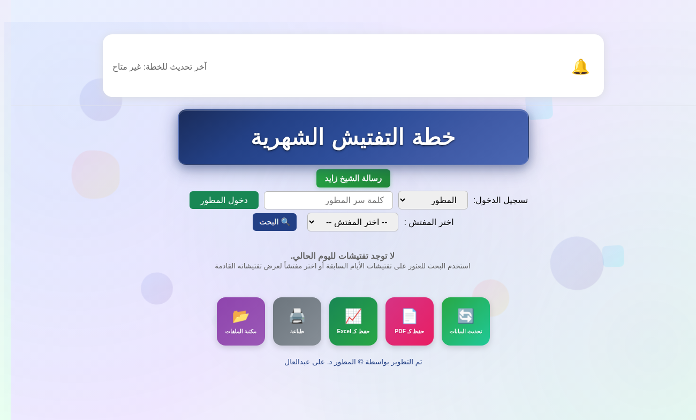
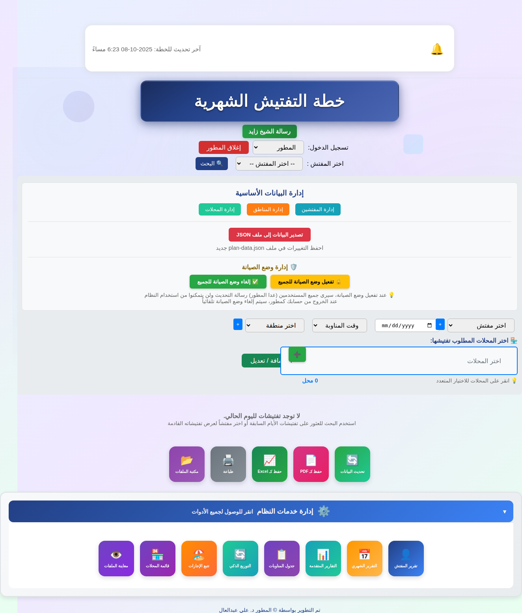
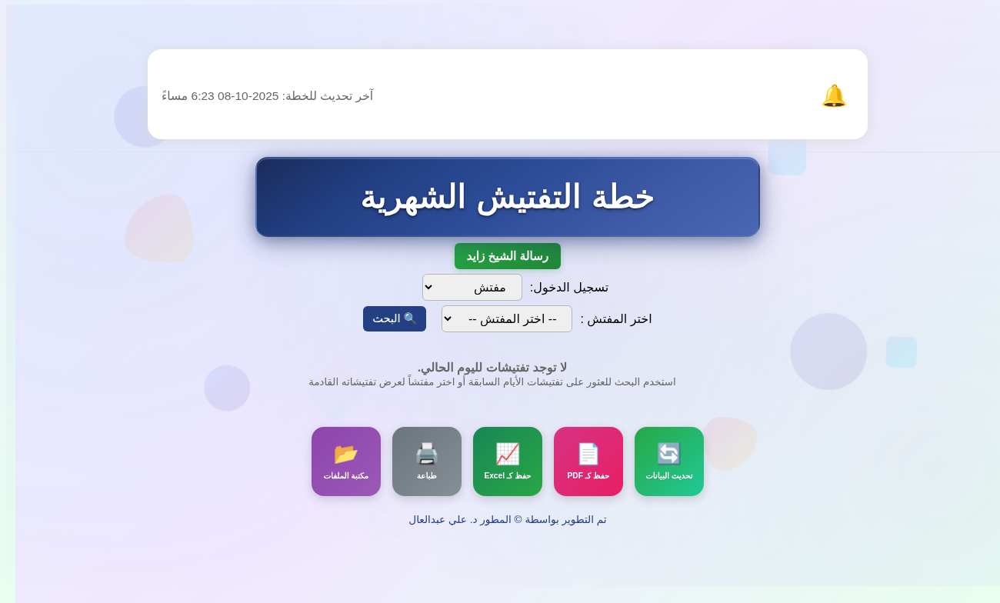

# إخفاء أيقونات إدارة خدمات النظام - Developer-Only System Services

## 📋 نظرة عامة - Overview

تم تطبيق ميزة إخفاء جميع أيقونات إدارة خدمات النظام وجعلها حصرية للمطور فقط. لن تظهر هذه الأيقونات لأي مستخدم (مفتش) ولا يمكن الوصول إليها إلا بعد تسجيل الدخول كمطور بكلمة السر الصحيحة.

## 🔒 متطلبات الأمان - Security Requirements

### الصلاحيات - Permissions
- **المطور فقط**: يمكنه رؤية والوصول إلى جميع أيقونات إدارة خدمات النظام
- **المفتشون**: لا يمكنهم رؤية أو الوصول إلى أيقونات إدارة خدمات النظام
- **المستخدمون غير المسجلين**: لا يمكنهم رؤية أو الوصول إلى أيقونات إدارة خدمات النظام

### التحقق من الهوية - Authentication
- كلمة السر المطور: `ali@1940`
- يجب إدخال كلمة السر الصحيحة للوصول إلى إدارة خدمات النظام

## 📝 التغييرات المنفذة - Implemented Changes

### 1. إخفاء القسم بشكل افتراضي
```html
<!-- تم إضافة style="display: none;" للعنصر -->
<div class="system-services-container" id="systemServicesContainer" style="display: none;">
```

### 2. إظهار القسم عند تسجيل دخول المطور
```javascript
// في دالة تسجيل الدخول
if (pw === DEV_PASSWORD) {
    isDev = true;
    // ...
    document.getElementById("systemServicesContainer").style.display = "block";
}
```

### 3. إخفاء القسم عند اختيار المفتش
```javascript
// عند اختيار "مفتش" من القائمة
document.getElementById("systemServicesContainer").style.display = "none";
```

### 4. إخفاء القسم عند تسجيل خروج المطور
```javascript
// في دالة تسجيل الخروج
document.getElementById("systemServicesContainer").style.display = "none";
```

## 🎯 الأيقونات المحمية - Protected Icons

### 📊 التقارير والتحليلات
- تقرير المفتش
- التقرير الشهري
- التقارير المتقدمة

### 📋 إدارة الجداول
- جدول المناوبات
- التوزيع الذكي
- تتبع الإجازات

### 🏪 إدارة البيانات
- قائمة المحلات
- معاينة الملفات

## 📸 لقطات الشاشة - Screenshots

### 1. الصفحة الرئيسية - لا توجد أيقونات إدارة خدمات النظام


**الوصف**: عند فتح الصفحة، لا تظهر أيقونات إدارة خدمات النظام لأي مستخدم.

---

### 2. اختيار المطور - ظهور حقل كلمة السر


**الوصف**: عند اختيار "المطور" من القائمة، يظهر حقل كلمة السر وزر "دخول المطور".

---

### 3. تسجيل دخول المطور - ظهور أيقونات إدارة خدمات النظام


**الوصف**: بعد إدخال كلمة السر الصحيحة وتسجيل الدخول، تظهر أيقونات إدارة خدمات النظام مع جميع الأدوات.

---

### 4. تسجيل خروج المطور - إخفاء أيقونات إدارة خدمات النظام


**الوصف**: عند تسجيل خروج المطور، تختفي أيقونات إدارة خدمات النظام فوراً.

---

### 5. اختيار المفتش - عدم ظهور أيقونات إدارة خدمات النظام


**الوصف**: عند اختيار "مفتش" من القائمة، لا تظهر أيقونات إدارة خدمات النظام.

## 🔍 طريقة الاختبار - How to Test

### للمطور:
1. افتح الصفحة الرئيسية `index.html`
2. من قائمة "تسجيل الدخول"، اختر "المطور"
3. أدخل كلمة السر: `ali@1940`
4. انقر "دخول المطور"
5. ✅ يجب أن تظهر أيقونات إدارة خدمات النظام

### للمفتش:
1. افتح الصفحة الرئيسية `index.html`
2. من قائمة "تسجيل الدخول"، اختر "مفتش"
3. ✅ يجب ألا تظهر أيقونات إدارة خدمات النظام

### تسجيل الخروج:
1. بعد تسجيل الدخول كمطور
2. انقر زر "إغلاق المطور"
3. ✅ يجب أن تختفي أيقونات إدارة خدمات النظام

## ✅ الفوائد - Benefits

1. **أمان محسّن**: منع الوصول غير المصرح به إلى أدوات الإدارة
2. **واجهة نظيفة**: المفتشون يرون فقط الأدوات المخصصة لهم
3. **تحكم كامل**: المطور فقط يمكنه الوصول إلى أدوات الإدارة الحساسة
4. **سهولة الاستخدام**: لا تشويش على المستخدمين بأيقونات لا يحتاجونها

## 🛡️ الأمان - Security

### طبقات الحماية:
1. **إخفاء CSS**: القسم مخفي بشكل افتراضي (`display: none`)
2. **فحص JavaScript**: التحقق من `isDev` قبل إظهار القسم
3. **التحقق من كلمة السر**: يجب إدخال كلمة السر الصحيحة للمطور
4. **وظائف محمية**: جميع الوظائف تستخدم `checkDeveloperAccess()` للتحقق من الصلاحيات

## 📝 الملفات المعدلة - Modified Files

- `index.html`: تم تعديل العنصر لإخفائه افتراضياً وتحديث منطق العرض/الإخفاء

## 🎉 الخلاصة - Summary

تم تطبيق الميزة بنجاح! الآن جميع أيقونات إدارة خدمات النظام مخفية افتراضياً ولا تظهر إلا للمطور بعد تسجيل الدخول بكلمة السر الصحيحة. هذا يحافظ على أمان النظام ويضمن أن الأدوات الحساسة متاحة فقط للمطور.

---

**تم التطوير بواسطة**: د. علي عبدالعال
**تاريخ التنفيذ**: 2025
