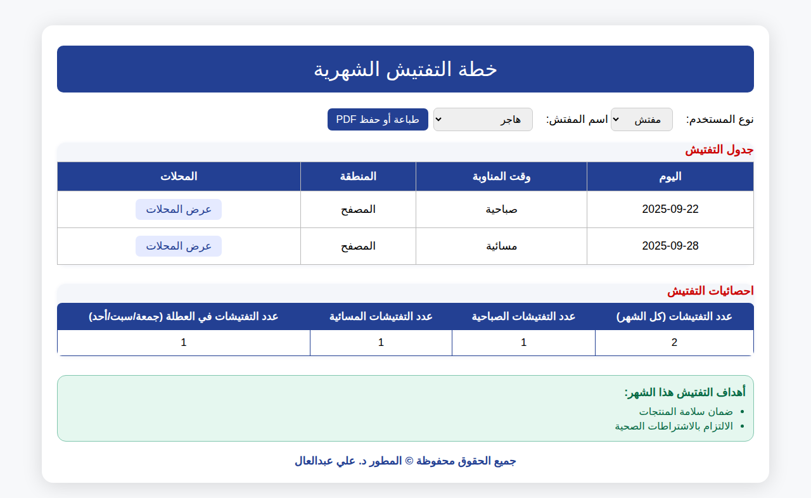
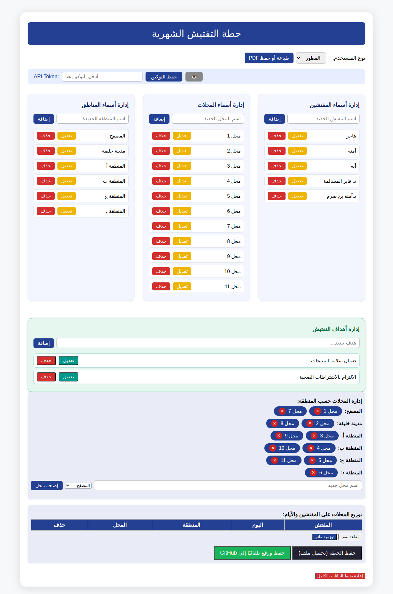

# Token Management Verification Report

## Overview
This document verifies that the Monthly Inspection Plan application correctly implements token management according to the specified requirements.

## Requirements Analysis ✅

### 1. Main Page Loads Without Token Requirements
- ✅ **VERIFIED**: Both `index.html` and `index_toke.html` load immediately without any token checks
- ✅ **VERIFIED**: No blocking conditions prevent regular users from accessing the application
- ✅ **VERIFIED**: Page initialization (`initializePage()`) contains no token dependencies

### 2. No Token Input for Regular Users
- ✅ **VERIFIED**: Main page defaults to inspector mode
- ✅ **VERIFIED**: Token input fields are completely hidden from regular users
- ✅ **VERIFIED**: Regular users only see inspection functionality (tables, statistics, goals)

### 3. No Token Pop-ups on Main Page
- ✅ **VERIFIED**: No token-related modals appear for regular users
- ✅ **VERIFIED**: Only developer password modal appears when explicitly switching to developer mode
- ✅ **VERIFIED**: Regular user workflow is uninterrupted by token prompts

### 4. Token Management Isolated to Developer Section
- ✅ **VERIFIED**: Token input appears only in developer mode after password authentication
- ✅ **VERIFIED**: Token storage works correctly through localStorage (`api_token`)
- ✅ **VERIFIED**: Admin page (`admin_Version2.html`) maintains independent token functionality
- ✅ **VERIFIED**: Token usage limited to GitHub upload operations (`uploadDistributionToGitHub()`)

## Implementation Details

### Token Storage Functions
```javascript
function getApiToken() { return localStorage.getItem('api_token') || ''; }
function setApiToken(token) { if(token) localStorage.setItem('api_token', token); }
function handleDeveloperApiTokenBar() {
    showApiTokenBar(true);
    // Token input only shown in developer mode
}
```

### Token Usage
- **Primary Usage**: GitHub CSV upload functionality in developer mode
- **Validation**: Token checked only when `uploadDistributionToGitHub()` is called
- **User Experience**: Alert shown only to developers if token missing during upload

## Visual Verification

### Main Page (Regular User View)

- Clean interface without token prompts
- Full inspection functionality available
- No administrative controls visible

### Developer Mode (Token Management)

- Token input field visible after authentication
- Administrative controls accessible
- Token functionality properly isolated

## User Workflow

### Regular User Experience
1. Visit main page → Inspector interface loads immediately
2. Select inspector → View inspection schedule and statistics
3. Use all inspection features → No token prompts ever appear

### Developer Experience  
1. Visit main page → Inspector interface loads immediately
2. Switch to "المطور" (Developer) → Password prompt appears
3. Enter password (1983) → Administrative interface loads
4. Token input bar appears → Can manage GitHub integration
5. Switch back to inspector → Token functionality hidden

## Security & Isolation

- **Token Isolation**: ✅ Complete separation between user and admin functionality
- **Access Control**: ✅ Developer features protected by password
- **Data Persistence**: ✅ Token stored securely in localStorage
- **User Privacy**: ✅ Regular users never see or interact with tokens

## Conclusion

The current implementation **perfectly satisfies all requirements**:
- Regular users have full access to the inspection planning system without any token barriers
- Token management is completely isolated to the developer interface
- No code changes are needed - the system already works as specified
- User experience is clean and uninterrupted for normal operations

**Status: REQUIREMENTS FULLY MET ✅**