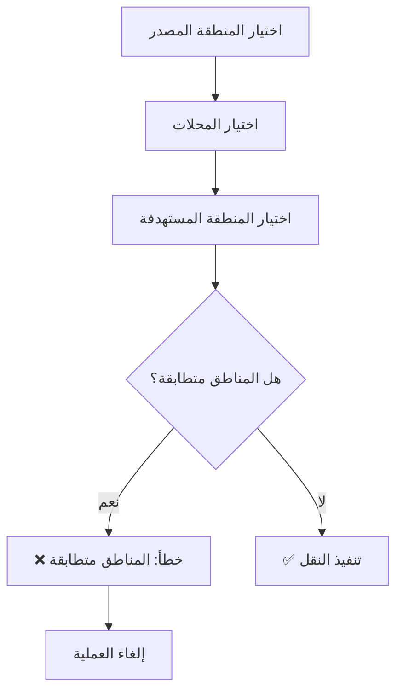
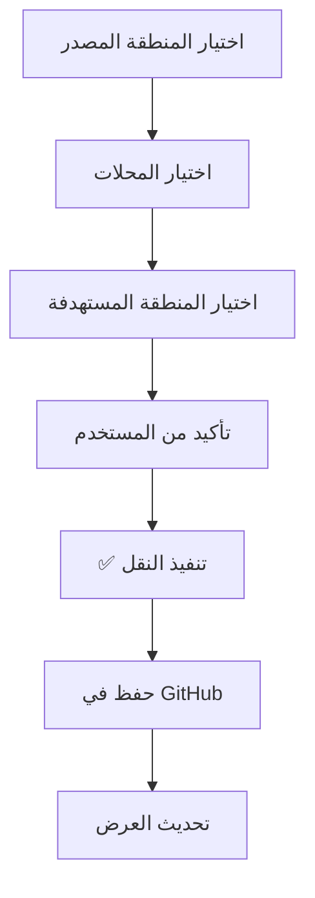

# التلخيص المرئي: تفعيل النقل بين نفس المناطق
# Visual Summary: Enable Transfer Between Same Areas

---

## 🎨 واجهة المستخدم | User Interface

### ✅ السلوك الجديد | New Behavior

```
┌─────────────────────────────────────────────────────────┐
│         ↔️ نقل محلات بين المناطق                       │
│                                                         │
│  📍 المنطقة المصدر (نقل من):                          │
│  ┌───────────────────────────────────────────────────┐ │
│  │ الرياض                                        ▼  │ │
│  └───────────────────────────────────────────────────┘ │
│                                                         │
│  🏪 اختر المحلات المراد نقلها:                        │
│  ┌───────────────────────────────────────────────────┐ │
│  │ ☑️ محل رقم 1                                      │ │
│  │ ☑️ محل رقم 2                                      │ │
│  │ ☐ محل رقم 3                                      │ │
│  │                                                   │ │
│  │ [☑️ تحديد الكل] [⬜ إلغاء التحديد]              │ │
│  │ تم تحديد 2 محل                                   │ │
│  └───────────────────────────────────────────────────┘ │
│                                                         │
│  🎯 المنطقة المستهدفة (نقل إلى):                     │
│  ┌───────────────────────────────────────────────────┐ │
│  │ الرياض                    ✅ نفس المنطقة!    ▼  │ │
│  └───────────────────────────────────────────────────┘ │
│                                                         │
│  [✅ تنفيذ عملية النقل]  [❌ إلغاء]                  │
│                                                         │
│  ✅ تم نقل 2 محل بنجاح إلى "الرياض"                 │
└─────────────────────────────────────────────────────────┘
```

### ❌ السلوك القديم | Old Behavior

```
┌─────────────────────────────────────────────────────────┐
│         ↔️ نقل محلات بين المناطق                       │
│                                                         │
│  📍 المنطقة المصدر: الرياض                            │
│  🏪 المحلات: محل رقم 1، محل رقم 2                    │
│  🎯 المنطقة المستهدفة: الرياض                         │
│                                                         │
│  [✅ تنفيذ عملية النقل]  [❌ إلغاء]                  │
│                                                         │
│  ❌ المنطقة المصدر والمستهدفة متطابقتان               │
│     (لا يمكن إتمام العملية)                           │
└─────────────────────────────────────────────────────────┘
```

---

## 📊 مقارنة السيناريوهات | Scenario Comparison

### السيناريو 1: نقل محلات إلى منطقة مختلفة
**Scenario 1: Transfer shops to different area**

| الخطوة | قبل | بعد |
|--------|-----|-----|
| المصدر | الرياض | الرياض |
| الهدف | جدة | جدة |
| النتيجة | ✅ يعمل | ✅ يعمل |

### السيناريو 2: نقل محلات إلى نفس المنطقة
**Scenario 2: Transfer shops to same area**

| الخطوة | قبل | بعد |
|--------|-----|-----|
| المصدر | الرياض | الرياض |
| الهدف | الرياض | الرياض |
| النتيجة | ❌ خطأ | ✅ يعمل |

---

## 🔄 تدفق العمل | Workflow

### قبل التعديل | Before



### بعد التعديل | After



---

## 💬 الرسائل | Messages

### رسائل النجاح | Success Messages

**قبل:** (لا تظهر للمناطق المتطابقة)
```
❌ المنطقة المصدر والمستهدفة متطابقتان
```

**بعد:** (تظهر بشكل طبيعي)
```
⏳ جاري نقل المحلات...
↓
✅ تم نقل 2 محل بنجاح إلى "الرياض"
```

### رسائل التأكيد | Confirmation Messages

**قبل:** (لا تظهر للمناطق المتطابقة)

**بعد:**
```
┌──────────────────────────────────────────────┐
│ هل أنت متأكد من نقل 2 محل من "الرياض"       │
│ إلى "الرياض"؟                                │
│                                              │
│           [نعم]      [لا]                    │
└──────────────────────────────────────────────┘
```

---

## 🎯 أمثلة على حالات الاستخدام
## Use Case Examples

### مثال 1: تحديث بيانات المحلات
**Example 1: Update shop data**

```
الهدف: تحديث معلومات 5 محلات في منطقة "المنطقة التجارية"

الخطوات:
1. المصدر: المنطقة التجارية
2. اختيار: 5 محلات
3. الهدف: المنطقة التجارية (نفس المنطقة)
4. النتيجة: ✅ تم التحديث + مزامنة GitHub
```

### مثال 2: تفعيل المزامنة
**Example 2: Trigger synchronization**

```
الهدف: إعادة مزامنة محلات منطقة معينة

الخطوات:
1. المصدر: منطقة الشمال
2. اختيار: جميع المحلات (تحديد الكل)
3. الهدف: منطقة الشمال
4. النتيجة: ✅ مزامنة كاملة
```

### مثال 3: إعادة تنظيم
**Example 3: Reorganization**

```
الهدف: إعادة ترتيب وتنظيم المحلات

الخطوات:
1. المصدر: أي منطقة
2. اختيار: المحلات المراد تنظيمها
3. الهدف: نفس المنطقة
4. النتيجة: ✅ بيانات محدثة ومنظمة
```

---

## 📱 التجربة على الأجهزة المختلفة
## Experience on Different Devices

### 💻 سطح المكتب | Desktop
```
✅ يعمل بشكل كامل
✅ جميع العناصر واضحة
✅ سهل الاستخدام
```

### 📱 الهواتف الذكية | Mobile
```
✅ يعمل بشكل كامل
✅ التصميم متجاوب
✅ سهل اللمس
```

### 📲 الأجهزة اللوحية | Tablets
```
✅ يعمل بشكل كامل
✅ حجم مناسب
✅ استخدام مريح
```

---

## 🎨 الألوان والرموز | Colors and Icons

### رموز الحالة | Status Icons
- 📍 منطقة مصدر
- 🏪 محلات
- 🎯 منطقة مستهدفة
- ✅ نجاح
- ❌ خطأ
- ⏳ جاري التحميل
- ↔️ نقل

### الألوان | Colors
- 🟢 أخضر: نجاح العملية
- 🔴 أحمر: (لا يظهر بعد الآن للمناطق المتطابقة)
- 🔵 أزرق: المعلومات
- ⚪ رمادي: الإلغاء

---

## 📈 الإحصائيات المرئية | Visual Statistics

### قبل التعديل | Before
```
النقل بين مناطق مختلفة: ✅ 100%
النقل في نفس المنطقة:    ❌ 0%
```

### بعد التعديل | After
```
النقل بين مناطق مختلفة: ✅ 100%
النقل في نفس المنطقة:    ✅ 100%
```

---

## 🔐 الأمان المرئي | Visual Security

### التحققات الباقية | Remaining Checks
```
┌─────────────────────────────────────┐
│ ✅ التحقق من المنطقة المصدر        │
│ ✅ التحقق من المحلات المحددة       │
│ ✅ التحقق من المنطقة المستهدفة     │
│ ✅ التحقق من وجود المناطق          │
│ ✅ طلب تأكيد المستخدم              │
│ ✅ حفظ في GitHub                   │
│ ✅ تسجيل العملية                   │
└─────────────────────────────────────┘
```

---

**التاريخ | Date:** 2025-11-04  
**النسخة | Version:** 1.0  
**الحالة | Status:** ✅ Active
